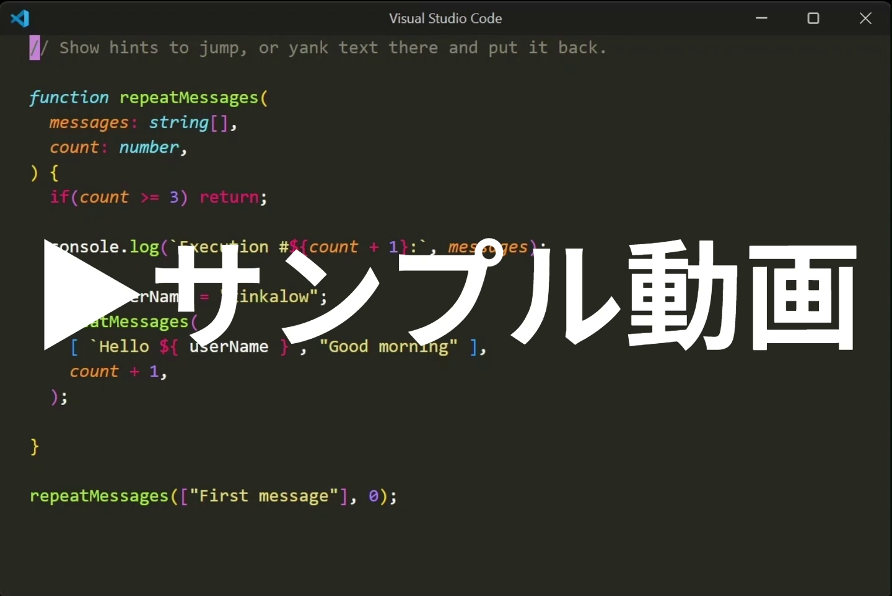

# myvim-vscode-extension

このリポジトリは、VS Code上でVimの操作性を拡張する拡張機能です。自身の開発作業を効率化するために作成し、コード編集やファイル・ウィンドウ操作、検索などのさまざまな機能をひとつのパッケージにまとめています。少ないキー操作でコードを効率的に編集できるよう、利便性を追求した機能を実装しています。

## デモ

**動画の説明**
|タイトル|説明|
|-|-|
|ラベルへジャンプ。ラベルからペースト|画面上のテキストに一時的なラベルを付け、ラベルを入力するだけで目的の位置へ移動できます。また、ラベル位置を起点として指定した範囲のテキストをペーストすることもできます。動画では行単位のペーストを行っています。|
|様々な範囲をコピー・置換|キャメルケースの単語、囲み記号（`''`、`""`、` `` `、`()`、`[]`、`{}`、`<>`）で囲まれた範囲、任意の入力文字、段落など、様々な単位でテキストをコピーできます。また、コピーしたテキストを指定範囲に置換することもできます。Vimの c や d に相当する操作にも対応しています。|
|囲みの追加・削除・置換|カーソル下の単語に囲み記号を追加できます。また、離れた位置にある囲み記号を削除したり、別の囲み記号へ置換したりできます。|
|要素交換|関数の引数や囲み記号で囲まれた要素など、構造を持った要素を素早く入れ替えられます。ネストした囲みや、外側の要素にも移動できます。|
|範囲交換|2つの選択テキストを入れ替えることができます。単語、ブロック、行、関数など、異なる単位の範囲交換に対応しています。|
|カーソル追従ハイライト＆ジャンプ|カーソル下の単語をハイライトし、画面内の同じ単語も同時にハイライトします。ハイライトした単語へ移動することもでき、コード中の同一単語の位置を素早く確認できます。|
|空白を無視して上下移動|上下移動時に空白・タブ部分を自動的にスキップし、現在の列位置を維持したまま目的の行へ素早く移動できます。|
|列整形|選択した行範囲に対して指定した文字を基準に列を揃えられます。代入演算子や囲み要素の位置を揃えたいときなどに利用します。|
|選択領域の差分|2つの選択範囲をVS CodeのDiff機能で比較できます。コードの差分を確認したいときに利用できます。|
|選択範囲を移動|選択したブロックや行のテキストのまとまりを、上下左右にある隣接したテキストと簡単に入れ替えられます。|
|コード実行|アクティブなエディタまたは選択したコードを実行し、結果を確認できます。|
|ファイル検索|ワークスペース内のファイルを検索し、開き方を選択したり、複数のファイルをまとめて開いたりできます。|
|グループ移動&リサイズ|VS Codeのエディタグループ間の移動や、グループサイズの変更を hjkl などのキー操作で行えます。|
|コード検索&ジャンプ|正規表現を利用してワークスペース内のテキストを検索し、該当箇所へジャンプできます。`RegexGrep` のような検索操作が可能です。|
|バッファ内でファイル操作|エディタ上の操作だけで、ファイルのコピーや削除などの基本的なファイル操作を実行できます。|

その他、動画では紹介していない機能として、カーソル下の単語をファイル内で一括置換する機能（LSPによるリネームが利用できない場合に利用）、Markdownメモの閲覧・編集、コピーしたテキストのストックと再利用、Vimの `*` 検索を拡張してカーソル下の検索対象を切り替えて検索できる機能、j/kによる一時的な半ページスクロール機能、選択した文字列のWeb検索なども実装しています。
